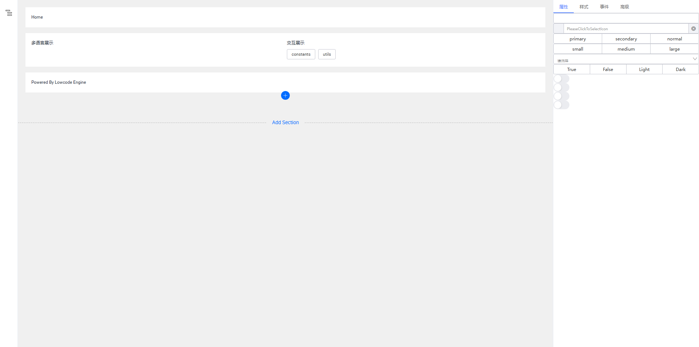

# mini版阿里低代码引擎

个人觉得阿里的低代码引擎很有趣想照着写个简化版本的

因为项目代码数量和模块还是挺多的所以目前只完成了三部分

1.基础框架的搭建  
2.页面渲染器的搭建  
3.右侧设置面板添加(一半完成度分类tab添加，下面具体属性设置还没添加)

效果图如下

如何启动

```
npm install --force // 一般更新博客一边画图一边写代码工作量太大将就着看下
npm run dev
```
